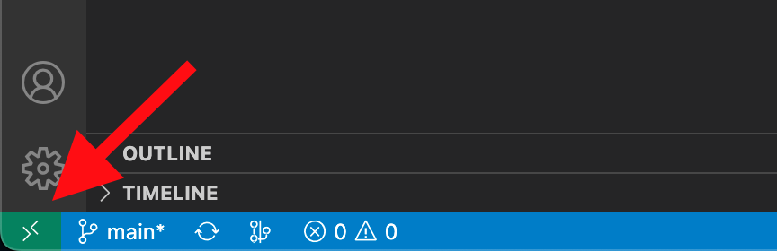
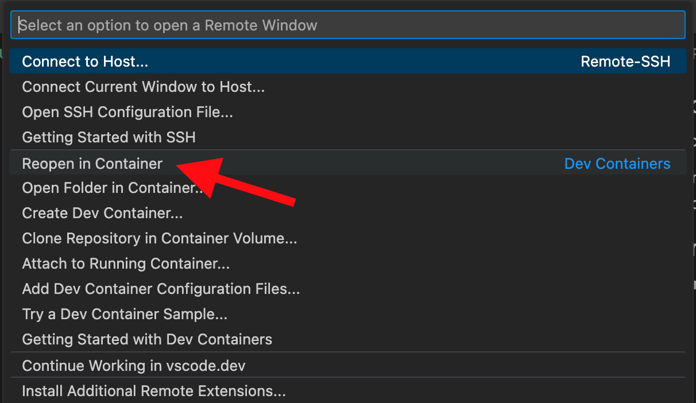

# Swanky dev container

## Intro

Dev container is a Visual Studio Code extension that allows for sharing a full dev environment.

This means you can develop your project inside a preconfigured container with all prerequisites met and correct dependencies installed. This includes Rust compiler, `cargo contract` and `swanky-cli`.

## Prerequisites

To run the container, you will need:

- Visual Studio Code with the [Dev Containers extension](https://marketplace.visualstudio.com/items?itemName=ms-vscode-remote.remote-containers) enabled
- Docker engine installed

More detailed information on system requirements can be [found here](https://code.visualstudio.com/docs/devcontainers/containers#_system-requirements).

## Usage

- fork or clone this repo (optionally rename the target dir), and open it in VS Code

There should be a popup in the lower-right offering you to open the container. Click "Reopen in Container".

You can also click on the green button on the lower-left to open the dev container commands menu, and select "Reopen in container" from there.

- shared folder
- using vscode integrated terminal

## Updating swanky version

- until auto update is configured, dl, unzip and copy link

## Configure and modify the container

- adding apt packages
- adding vscode extensions
- add features

## References

https://github.com/AstarNetwork/swanky-dev-container/tree/main/images/button.png
https://github.com/AstarNetwork/swanky-dev-container/tree/main/images/menu.png
https://github.com/AstarNetwork/swanky-dev-container/tree/main/images/popup.png
https://github.com/AstarNetwork/swanky-dev-container/blob/main/images/button.png
